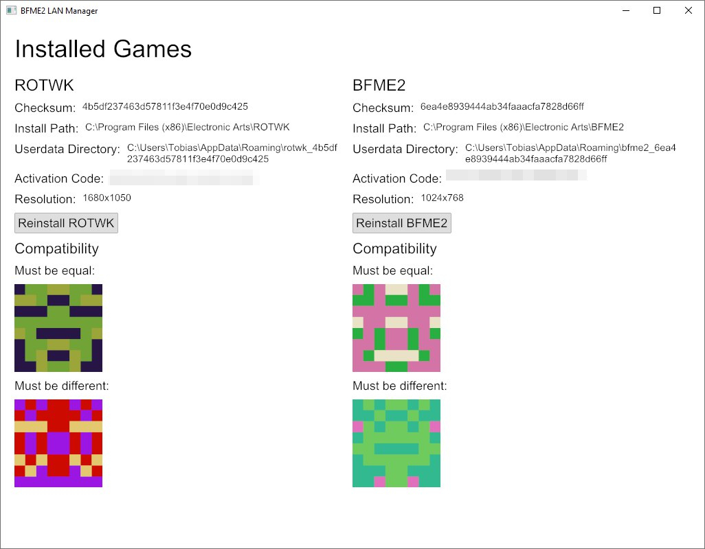

# Battle for Middle Earth (2) LAN manager

## What is this about?

Battle for Middle Earth 2 (in all it's variants and patch levels) has a very nasty "out of synch" error that makes setting up working multiplayer matches with multiple people a pain.
When troubleshooting the issue, I discovered, that it suffices for any player to have created a custom hero at any point with a different version of the game (patch level, missing community patch, etc.) to cause said error - mind you not at match creation, but at the point in the game when they access the thing (e.g. hero) that's "tainted" by an incompatible game version.
This LAN manager helps recognizing whether your games are compatible and distributing a version among multiple people.
It also keeps separate game files for each unique version of the game. That way, all sources for the notorious error should be avoided.

## Usage

1. Take a split archive of an existing game directory (to be included in the application) of both BFME 2 and (optionally) the Rise of the Witch King extension.
2. Start the BFME LAN manager and follow the installation steps. Point it to the directory containing the split archive in the respective step.
3. Compare the pixel art or hash sums to see whether your games are compatible.

